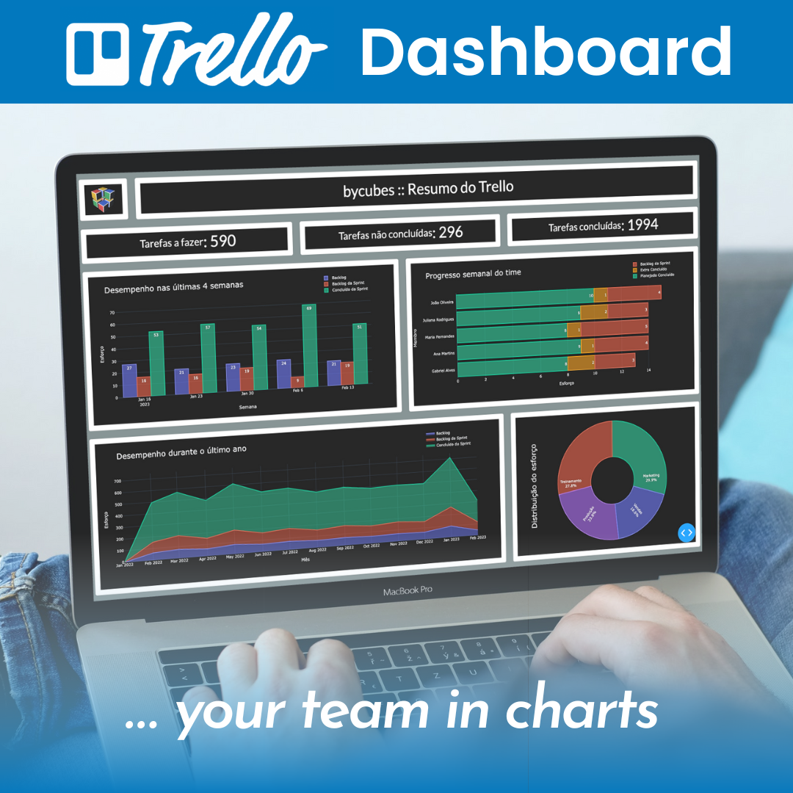

# Trello Dash 100% Python :: Your team in charts

## This tool takes your Trello Kanban Board and summarizes it through performance charts



To run this, first you need to create a python virtual environment, 
and install all the requirements, according to the requirements.txt file

```
pip install -r requirements.txt
```

Next, you need to create a file called credentials.py in the root folder 
and enter the following keys corresponding to your Trello account:

```
api_key = ""
token = ""
```

** This can be obtained easily from a Google Search, 
but you will need to register your account as a trello dev. Don't worry, it's free.

Still in the credentials.py file opened, enter:

```
board_id = ""
```

Save the file and start adapting your board (if you haven't already) making the
lists contain keywords that identify them as "TO DO", "DOING" and "DONE".

The next step is to configure the config.py file according to your board:
* Configure the "stage_list" dictionary according to the defined keywords that will be present in the titles of the kanban lists.
* You can use one or more task types on your board. Also use keywords to separate your kanban lists by types.

Finally, you can run the "main.py" file and access your trello dashboard at http://127.0.0.1:8050

** Don't worry about the initial error as Trello doesn't allow access to data that quickly. The first data can take up to 10 min to arrive.

** Please, when using this code, do not forget to cite the source, this ensures its ethics and is free of charge.

> "A criatividade é a inteligência se divertindo." - Albert Einstein
